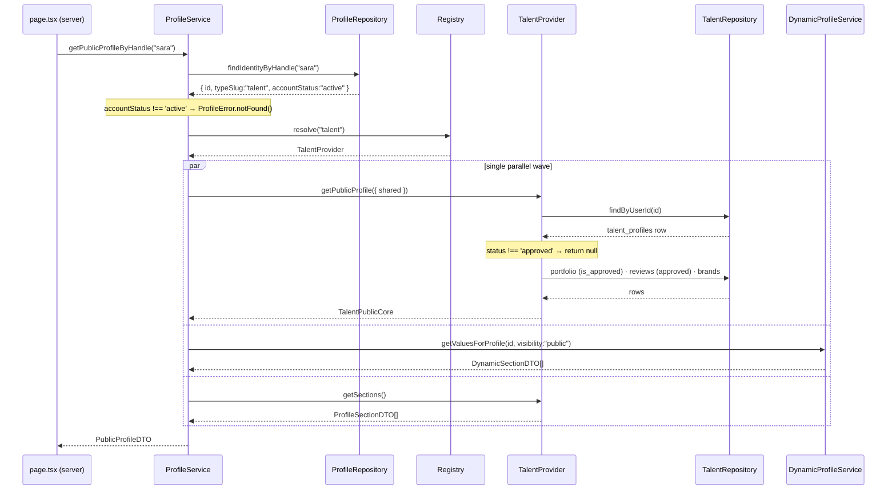
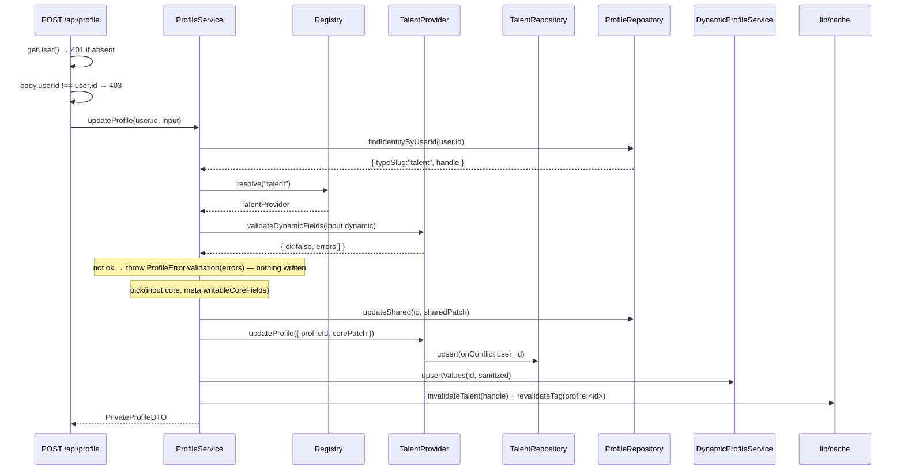
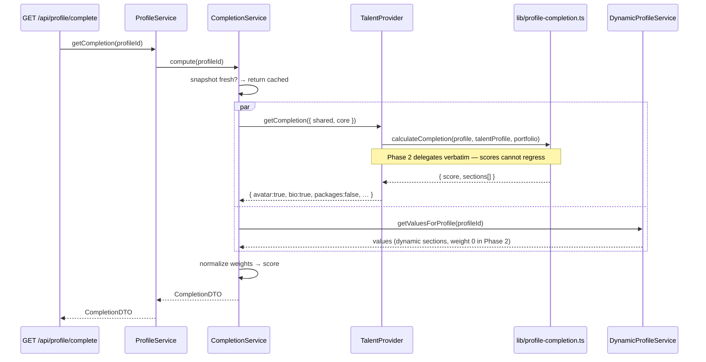
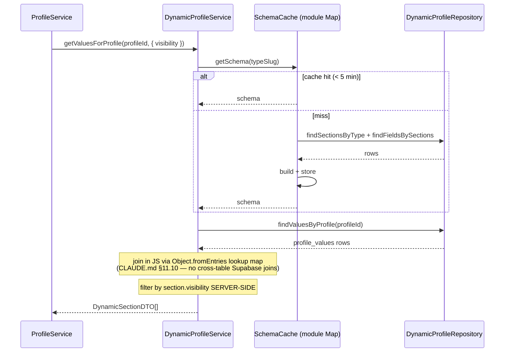
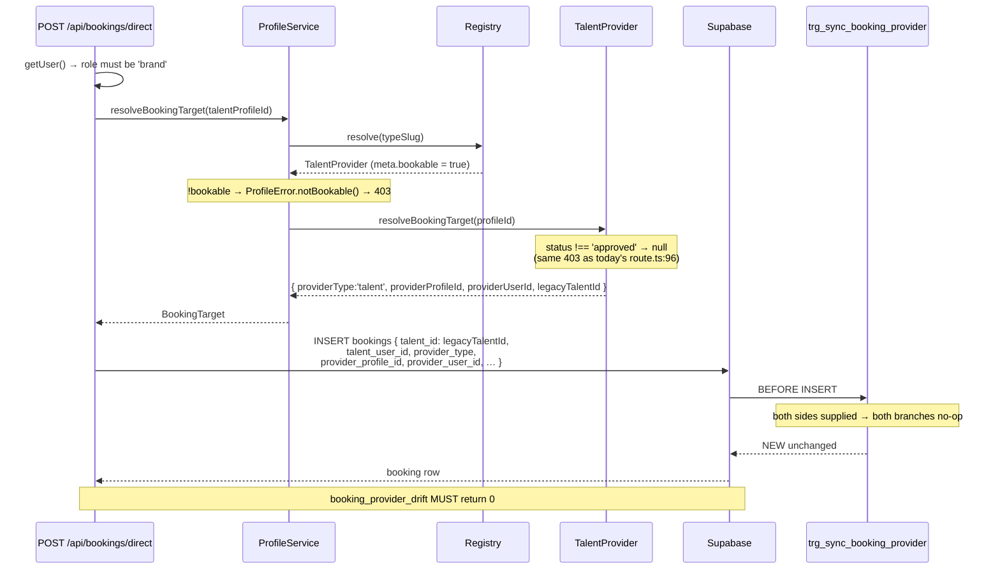

# Phase 2 — Profile Provider Adapter Layer

> **Status:** Architecture for review. **No implementation until approved.**
> **Phase 1:** complete (see `supabase/migrations/20260806_*`).
> **Companion docs:** [PROFILE_ARCHITECTURE_V2.md](./PROFILE_ARCHITECTURE_V2.md), [CLAUDE.md](./CLAUDE.md).
>
> **Constraints honoured:** no breaking changes · no UI changes · no route migration · no React ·
> no API implementation · no controller queries against `talent_profiles` when done ·
> booking system unchanged.

---

## 0. Call-site census — what Phase 2 is actually up against

Measured, not estimated: **31 direct `talent_profiles` queries across 22 files**, plus 1
`brand_profiles` query. They are **three different problems** and conflating them is the main way
this phase goes wrong.

### Class A — ID resolution (≈12 sites, the majority)

```ts
// app/api/bookings/route.ts:31, app/api/portfolio/route.ts:28 & 68, and ~9 more
.from("talent_profiles").select("id").eq("user_id", user.id).maybeSingle()
```

Not a profile load. It is one question: *"what is this user's provider row id?"* These become a
single repository call. **They must not be routed through `ProfileService.getPrivateProfile()`** —
that would turn a one-column lookup into a full multi-table profile assembly on the hot booking path.

| File | Line | Purpose |
|---|---|---|
| `app/api/bookings/route.ts` | 31 | own bookings list |
| `app/api/portfolio/route.ts` | 28, 68 | ownership check on portfolio write |
| `app/api/bookings/direct/route.ts` | 94 | target lookup **+ `status !== 'approved'` gate** |
| `app/api/bookings/[id]/route.ts`, `[id]/review/route.ts` | — | ownership checks |
| `app/api/jobs/[id]/applications/route.ts`, `[appId]/route.ts` | — | applicant → provider row |
| `app/(main)/bookings/page.tsx`, `[id]/page.tsx` | — | server page ownership |
| `app/(main)/jobs/[id]/applications/page.tsx` | — | server page |
| `app/api/reviews/route.ts` | — | review target |

### Class B — genuine profile loads (≈5 sites)

`app/api/me/route.ts:47` (private self-view) · `features/talent-profile/services/talent-profile.service.ts`
(public view, 5 functions) · `app/api/admin/talents/[id]/profile/route.ts` (admin editor) ·
`app/api/profile/route.ts` (write) · `app/api/profile/complete/route.ts`.

These are the real `ProfileService` clients.

### Class C — domain-owned writes (≈4 sites, **explicitly out of scope**)

`lib/recalcRating.ts:45` writes `avg_rating`/`total_reviews`. `app/api/admin/recalc-ratings/route.ts`,
`seed/route.ts`, `seed-all/route.ts`, `debug-user/route.ts`.

Rating is recomputed by a **database trigger** (`trigger_sync_rating.sql`); `recalcRating.ts` is a
manual repair tool. Routing derived-column repair and one-off seed scripts through a profile
abstraction adds indirection and buys nothing.

> **Scope decision:** Class C keeps its direct `adminClient` access, and the "no direct
> `talent_profiles` queries" rule carries a documented allowlist. Pretending otherwise produces a
> `ProfileService.updateRating()` method that exists only to satisfy a lint rule.

**Phase 2 target: Class A + Class B = ~17 sites migrated. Class C: 4 sites allowlisted.**

---

## 1. Overall architecture

```
┌─────────────────────────────────────────────────────────────────────────────┐
│  Server Components  ·  Client Components                    UNCHANGED       │
│  app/(main)/**/page.tsx · *Client.tsx                       in Phase 2      │
└───────────────────────────────┬─────────────────────────────────────────────┘
                                │  props / fetch("/api/…")
┌───────────────────────────────▼─────────────────────────────────────────────┐
│  CONTROLLER              app/api/**/route.ts                                │
│  • export const runtime = 'edge'                                            │
│  • supabase.auth.getUser()      ← authN stays here                          │
│  • role / ownership check       ← authZ stays here                          │
│  • maps ProfileError → NextResponse.json({ error }, { status })             │
│  ✗ never imports adminClient for a profile table                            │
└───────────────────────────────┬─────────────────────────────────────────────┘
                                │  typed DTO in / DTO out
┌───────────────────────────────▼─────────────────────────────────────────────┐
│  ORCHESTRATION           features/profiles/services/profile.service.ts      │
│  • resolve profile type → provider                                          │
│  • fan out with Promise.all, assemble the DTO                               │
│  • own the cache boundary (lib/cache.ts tags)                               │
│  • translate every failure into ProfileError                                │
│  ✗ knows no table names                                                     │
└──────┬──────────────────────────────────────────────┬───────────────────────┘
       │                                              │
┌──────▼────────────────────┐            ┌────────────▼────────────────────────┐
│  REGISTRY                 │            │  DYNAMIC LAYER (type-agnostic)      │
│  providers/registry.ts    │            │  profile-schema.service.ts          │
│  static Map<slug,Provider>│            │  profile-values.service.ts          │
│  Open/Closed seam         │            │  completion.service.ts (Phase 3)    │
└──────┬────────────────────┘            └────────────┬────────────────────────┘
       │                                              │
┌──────▼──────────────────────────────────────────────▼───────────────────────┐
│  PROVIDERS   TalentProvider · BrandProvider · (AgencyProvider, Phase 5)     │
│  • the ONLY code that knows talent_profiles vs brand_profiles exists        │
│  • core-field allowlist · core→view mapping · core completion evaluation    │
│  • booking target resolution (bookable providers only)                      │
│  ✗ no HTTP, no auth, no cache, no NextResponse                              │
└───────────────────────────────┬─────────────────────────────────────────────┘
                                │
┌───────────────────────────────▼─────────────────────────────────────────────┐
│  REPOSITORIES            features/profiles/repositories/*                   │
│  ProfileRepository · TalentRepository · BrandRepository                     │
│  DynamicProfileRepository · ProviderRefRepository                           │
│  • one table each, CRUD + filters, raw row types                            │
│  ✗ zero business logic, zero branching on role, zero DTO construction       │
└───────────────────────────────┬─────────────────────────────────────────────┘
                                │
┌───────────────────────────────▼─────────────────────────────────────────────┐
│  lib/supabase/admin.ts (service role, RLS BYPASSED) · Supabase Postgres     │
└─────────────────────────────────────────────────────────────────────────────┘
```

### Layer responsibilities

| Layer | Owns | Must never |
|---|---|---|
| **Controller** | `getUser()`, role/ownership authorization, HTTP status mapping, response headers | Import `adminClient` for a profile table; construct a DTO |
| **ProfileService** | Type detection, provider resolution, parallel fan-out, DTO assembly, caching, error translation | Name a table; branch on `role`; call `NextResponse` |
| **Registry** | Static slug → provider map; unknown-slug error | Do I/O; be mutated at runtime |
| **Provider** | Everything type-specific: core allowlist, core→view mapping, core completion, booking target | Know about HTTP, auth, caching, or another provider |
| **Dynamic layer** | `profile_sections` / `profile_fields` / `profile_values`; identical for every type | Be duplicated per provider |
| **Repository** | One table. Parameterized CRUD. Returns raw DB rows | Contain an `if (role === …)`; join across domains; throw HTTP errors |

### Why authorization stays in the controller

CLAUDE.md §3: RLS is bypassed on every service-role read, so authorization is application code.
Moving authZ into `ProfileService` would create two authorization surfaces during the migration
window — the worst possible state. **Phase 2 moves data access. It does not move authorization.**

---

## 2. Provider interface

```ts
// features/profiles/types/provider.ts

/** Immutable facts about a provider, readable without any I/O. */
export interface ProviderMetadata {
  readonly typeSlug: string;          // 'talent' | 'brand' | 'agency'
  readonly coreTable: string;         // audit/logging only; callers never use it to query
  readonly bookable: boolean;
  readonly routePrefix: string;       // Phase 4 route resolver
  readonly writableCoreFields: readonly string[];
}

export interface ProfileProvider<
  TCoreRow  = unknown,
  TPublic   = unknown,
  TPrivate  = unknown,
> {
  readonly meta: ProviderMetadata;

  getPublicProfile(input: {
    shared: SharedIdentityRow;
    dynamic: DynamicSectionDTO[];
  }): Promise<TPublic | null>;

  getPrivateProfile(input: {
    shared: SharedIdentityRow;
    dynamic: DynamicSectionDTO[];
  }): Promise<TPrivate | null>;

  updateProfile(input: {
    profileId: string;
    corePatch: Record<string, unknown>;
  }): Promise<void>;

  getSections(): Promise<ProfileSectionDTO[]>;

  getCompletion(input: {
    shared: SharedIdentityRow;
    core: TCoreRow;
  }): Promise<CoreSectionState>;

  validateDynamicFields(input: {
    values: Record<string, unknown>;
  }): Promise<DynamicValidationResult>;

  /** Present only when meta.bookable === true. */
  resolveBookingTarget?(profileId: string): Promise<BookingTarget | null>;
}
```

### Method contracts

**`getPublicProfile`** — assembles the guest-visible view model. Receives `shared` and `dynamic`
pre-loaded by `ProfileService` so the provider never re-queries `profiles` and the dynamic layer runs
once regardless of type. Returns `null` when the core row is missing or fails the provider's public
gate (talent: `status === 'approved'`; brand: `status === 'approved'`). **The provider owns that
gate** — CLAUDE.md §8 requires public server pages using `adminClient` to reapply public filters in
code, and centralizing it here is exactly how that stops being forgotten per-route.

**`getPrivateProfile`** — the owner's own view. Includes moderation state (`status`,
`rejection_reason`), unapproved portfolio items, and private dynamic sections. **Never call this for
another user's profile.** The controller's ownership check is what makes that true.

**`updateProfile`** — upserts the typed core row. `corePatch` is **already filtered** by
`ProfileService` against `meta.writableCoreFields`; the provider filters again (defence in depth —
`app/api/profile/route.ts:9-13` documents why: this write goes through the service role, so a
mass-assignment hole here writes moderation and money columns).

**`getSections`** — section *definitions* for the type from `profile_sections`, merged with the
provider's core-section descriptors. Definitions only, no user values. Cached; see §8.

**`getCompletion`** — evaluates **core** sections only, returning `{ [sectionKey]: boolean }`.
Dynamic sections are scored generically by the completion service, because "is a `profile_values`
row present" needs no type knowledge. **In Phase 2 the talent implementation delegates verbatim to
`lib/profile-completion.ts`** so scores cannot regress; Phase 3 replaces the internals behind this
unchanged signature.

**`validateDynamicFields`** — compiles `profile_fields` to a Zod schema and validates. Returns a
result object, never throws. Lives on the provider (not the dynamic service) so a type can add
cross-field rules later — e.g. an agency requiring `team_size` when `is_registered` is true.

**`resolveBookingTarget`** — optional, `bookable` providers only. Returns the polymorphic booking
target **including `legacyTalentId`**. See §3.5 — this is the whole backward-compatibility story.

---

## 3. Provider implementations

### 3.1 What every provider declares

| | **TalentProvider** | **BrandProvider** | **AgencyProvider** (Phase 5) |
|---|---|---|---|
| `typeSlug` | `talent` | `brand` | `agency` |
| `coreTable` | `talent_profiles` | `brand_profiles` | `agency_profiles` |
| `bookable` | ✅ | ❌ | ✅ |
| `routePrefix` | `talent` | `brand` | `agency` |

### 3.2 TalentProvider

**Core fields** (`talent_profiles`) — exactly today's `TALENT_FIELDS` (`app/api/profile/route.ts:18`):
`category`, `specialties`, `social_links`, `bio`, `packages`, `availability`.
Read-only core: `id`, `user_id`, `profile_views`, `avg_rating`, `total_reviews`, `total_bookings`,
`is_featured`, `status`, `approved_at`, `rejection_reason`.

> **`avg_rating`, `total_reviews`, `total_bookings` are trigger-maintained and are NEVER writable
> through `updateProfile`.** They are absent from `writableCoreFields`, which is what makes the
> Class C carve-out safe.

**Related data**, reusing the existing service verbatim (`features/talent-profile/services/talent-profile.service.ts`):
`portfolio_items` (public: `is_approved = true` only) · `reviews` (public: `status = 'approved'`
only) · `talent_brands` · booking stats.

**Dynamic fields:** `equipment`, `awards`, `experience` — seeded in `20260806_08`.

**Computed:** `rating` (rounded), `reviewCount`, `views` (display-formatted), `verified`
(`profiles.is_verified`), `memberSince`, `bookingStats`, `isBookable = status === 'approved'`.

**Completion (Phase 2):** delegates to `calculateCompletion(profile, talentProfile, portfolioItems)`
and maps its `sections[]` to `{ key: done }`. Zero behavioural change.

**Booking:** `resolveBookingTarget` returns `{ providerType: 'talent', providerProfileId:
talent_profiles.id, providerUserId: user_id, legacyTalentId: talent_profiles.id }`.

**Migration note — the `status` gate.** `app/api/bookings/direct/route.ts:96` currently rejects
non-approved talents. That check moves into `resolveBookingTarget`, which returns `null` for a
non-approved talent. The controller keeps emitting the identical 403 body. **Behaviour must be
byte-identical; this is an acceptance test (§12).**

### 3.3 BrandProvider

**Core fields** (`brand_profiles`) — today's `BRAND_FIELDS` (`app/api/profile/route.ts:22`):
`company_name`, `category_id`, `industry`, `website_url`, `social_links`.
Read-only: `id`, `user_id`, `profile_views`, `status`, `approved_at`, `rejection_reason`.

**Related:** `profile_categories` join, jobs posted (count only, on the public view).

**Dynamic:** `campaign_preferences` — seeded in `20260806_08`.

**Computed:** `verified` (`profiles.is_verified` + `brand_profiles.status === 'approved'`),
`jobsPosted`, `memberSince`, `isBookable = false`.

**Completion:** new logic (no legacy equivalent exists) written directly against the interface —
`company_info`, `industry`, `logo`, `social`, `verification`.

**Booking:** `resolveBookingTarget` is **absent**. `meta.bookable === false`. Calling it is a
compile error, not a runtime one.

> **Known drift to preserve, not fix:** `profiles.brand_status` (CLAUDE.md §8) and
> `brand_profiles.status` are two overlapping brand approval flags. Phase 2 reads whatever the code
> reads today and changes nothing. Unifying them is Phase 4 work — doing it here would smuggle a
> behaviour change into a refactor.

### 3.4 AgencyProvider (Phase 5 — proving the seam)

Full delta to add it:

1. `CREATE TABLE agency_profiles` + `INSERT INTO profile_types` (`is_active = true`).
2. Seed its `profile_sections` / `profile_fields` / `profile_layouts`.
3. Write `agency.provider.ts` (~120 lines).
4. Add one line to `registry.ts`.
5. Run the Phase-4 `bookings.talent_id` nullability + CHECK migration.

**Zero edits to `ProfileService`, any repository, any DTO, or any booking route.** That is the
Open/Closed acceptance test (§12).

### 3.5 How bookings stay unchanged

```
                        resolveBookingTarget()
                                 │
                    ┌────────────┴────────────┐
             TalentProvider              AgencyProvider (Phase 5)
                    │                            │
    legacyTalentId = talent_profiles.id   legacyTalentId = null
                    │                            │
                    └────────────┬───────────────┘
                                 ▼
         booking insert writes BOTH:
             talent_id           = target.legacyTalentId
             provider_type       = target.providerType
             provider_profile_id = target.providerProfileId
             provider_user_id    = target.providerUserId
                                 │
                                 ▼
         trg_sync_booking_provider (Phase 1) reconciles either direction
                                 │
                                 ▼
         booking_provider_drift MUST return 0 rows
```

For talents the two agree, so every existing query, RLS policy, admin report and the rating trigger
see byte-identical rows. **Phase 2 changes what writes `talent_id`, never what `talent_id` means.**

Every booking read in Phase 2 still uses `talent_id`. Switching reads to `provider_profile_id` is
Phase 5, one route at a time.

---

## 4. ProfileService

### 4.1 Type detection — three inputs, one resolution path

```
getPublicProfileByHandle(handle)   ─┐
getProfileById(profileId)          ─┼──►  ProfileRepository.findIdentity(…)
getOwnProfile(userId)              ─┘         │
                                              ▼
                              profiles.profile_type_id  ──► profile_types.slug
                                              │
                              NULL? ──► fallback: map profiles.role
                                              │        (talent | brand|client)
                                              ▼
                                    registry.get(slug)
                                              │
                              missing? ──► ProfileError('INVALID_PROFILE_TYPE')
```

**The `role` fallback is mandatory in Phase 2 and must be instrumented.** Phase 1 backfilled
`profile_type_id` and installed `trg_sync_profile_type`, but a single missed row would 500 a
profile page. The fallback logs a `WARN` with the profile id every time it fires. **A prerequisite
for Phase 4 dropping the trigger is: zero warnings for 7 consecutive days.**

Admins have `profile_type_id = NULL` **by design** (Phase 1, step 2) and no public profile.
`getPublicProfileByHandle` returns `NOT_FOUND` for them — not an error.

### 4.2 Assembly — one fan-out, no N+1

```ts
async getPublicProfileByHandle(handle: string): Promise<PublicProfileDTO> {
  const identity = await profileRepository.findIdentityByHandle(handle);
  if (!identity || identity.accountStatus !== "active") throw ProfileError.notFound();

  const provider = registry.resolve(identity.typeSlug);          // may throw INVALID_PROFILE_TYPE

  // Single parallel wave. Dynamic + schema are type-agnostic and run for every type.
  const [core, dynamic, sections] = await Promise.all([
    provider.getPublicProfile({ shared: identity, dynamic: [] }),
    dynamicProfileService.getValuesForProfile(identity.id, { visibility: "public" }),
    provider.getSections(),
  ]);

  if (!core) throw ProfileError.notFound();                       // provider's public gate

  return assemblePublicDTO({ identity, core, dynamic, sections, meta: provider.meta });
}
```

Merge order, deterministic: **shared identity → provider core → computed → dynamic → completion**.
Later stages never overwrite earlier ones; a dynamic field whose key collides with a core field is
dropped and logged. (Cheap to enforce: core keys are a compile-time constant per provider.)

`getOwnProfile` adds a fourth parallel call to `completionService`; the public path never computes
completion.

### 4.3 Public surface

```ts
interface IProfileService {
  getPublicProfileByHandle(handle: string): Promise<PublicProfileDTO>;
  getPublicProfileById(profileId: string): Promise<PublicProfileDTO>;
  getOwnProfile(userId: string): Promise<PrivateProfileDTO>;
  updateProfile(userId: string, input: UpdateProfileInput): Promise<PrivateProfileDTO>;
  getSections(typeSlug: string): Promise<ProfileSectionDTO[]>;
  getCompletion(profileId: string): Promise<CompletionDTO>;

  /** Class A replacement. Deliberately NOT a full profile load. */
  resolveProviderRef(userId: string): Promise<ProviderRef | null>;
  resolveBookingTarget(profileId: string): Promise<BookingTarget>;   // throws NOT_BOOKABLE
}
```

`resolveProviderRef` is the single most-called method in the system after Phase 2 (12 sites). It
must stay one indexed query returning `{ profileId, typeSlug, providerProfileId }`.

---

## 5. Repository layer

One table each. No business logic. No role branching. Raw rows in, raw rows out.

| Repository | Table(s) | Methods | Never |
|---|---|---|---|
| **ProfileRepository** | `profiles` (+ `profile_types` for the slug) | `findIdentityById`, `findIdentityByHandle`, `findIdentityByUserId`, `updateShared` | Load a core table |
| **TalentRepository** | `talent_profiles` | `findByUserId`, `findById`, `upsert`, `findIdByUserId` | Touch `profiles` or `brand_profiles` |
| **BrandRepository** | `brand_profiles` | `findByUserId`, `findById`, `upsert` | Touch `talent_profiles` |
| **DynamicProfileRepository** | `profile_sections`, `profile_fields`, `profile_values`, `profile_layouts` | `findSectionsByType`, `findFieldsBySections`, `findValuesByProfile`, `upsertValues`, `deleteValues`, `findLayout` | Validate; decide visibility |
| **ProviderRefRepository** | `profiles` ⋈ core tables | `resolveRef(userId)`, `resolveRefByProfileId` | Return a full profile |
| **BookingRepository** *(read-only in Phase 2)* | `bookings` | `findByProviderRef`, `countByStatus` | Write. Booking writes stay in their existing routes |

**`ProfileRepository.findIdentity*` returns the joined `profile_types.slug`**, so type detection is
one query, not two.

**Why `ProviderRefRepository` is separate from `TalentRepository`:** the ref resolver must work for
any type. Putting it on `TalentRepository` would make every Class A caller import the talent
repository — reintroducing exactly the coupling this phase removes.

**`BookingRepository` is read-only in Phase 2.** Booking *writes* keep their current inline
`adminClient` calls, gaining only a `resolveBookingTarget()` call for the shadow columns. Rewriting
booking writes and introducing the adapter simultaneously means a failure could not be attributed to
either. Booking write migration is Phase 5.

---

## 6. DTOs

```ts
// features/profiles/types/dto.ts

// ─── Shared ──────────────────────────────────────────────────────────────────
export interface SharedIdentityDTO {
  id: string;
  handle: string | null;
  fullName: string | null;
  avatarUrl: string | null;
  city: string | null;
  bio: string | null;
  isVerified: boolean;
  createdAt: string;
  typeSlug: string;
}

export interface ProviderMetadataDTO {
  typeSlug: string;
  labelAr: string;
  labelEn: string;
  routePrefix: string;
  bookable: boolean;
  /** Deliberately excludes coreTable — the wire format must not leak table names. */
}

// ─── Dynamic ─────────────────────────────────────────────────────────────────
export type DynamicFieldType =
  | "text" | "number" | "boolean" | "select" | "multi_select" | "media" | "json";

export interface DynamicFieldDTO {
  key: string;
  label: { ar: string; en: string };
  placeholder?: { ar: string; en: string };
  helpText?: { ar: string; en: string };
  fieldType: DynamicFieldType;
  isRequired: boolean;
  options: Array<{ value: string; label: { ar: string; en: string } }>;
  /** Present on private DTOs only — the edit form needs it, public viewers do not. */
  validation?: Record<string, unknown>;
  value: unknown | null;
  displayOrder: number;
}

export interface ProfileSectionDTO {
  key: string;
  title: { ar: string; en: string };
  description?: { ar: string; en: string };
  kind: "core" | "dynamic";
  renderComponent: string | null;
  icon: string | null;
  displayOrder: number;
  fields: DynamicFieldDTO[];       // always [] for kind === 'core'
}

// ─── Completion ──────────────────────────────────────────────────────────────
export interface CompletionSectionDTO {
  key: string;
  label: { ar: string; en: string };
  weight: number;
  done: boolean;
  href: string;
}

export interface CompletionDTO {
  score: number;                   // 0-100
  sections: CompletionSectionDTO[];
  gates: Array<{
    key: string;                   // 'apply_to_jobs' | 'receive_briefs' | …
    minScore: number;
    passed: boolean;
    enforced: boolean;             // false everywhere in Phase 2
  }>;
  computedAt: string;
}

// ─── Booking ─────────────────────────────────────────────────────────────────
export interface BookingTarget {
  providerType: string;
  providerProfileId: string;
  providerUserId: string;
  /** Non-null ONLY for the talent provider. The backward-compatibility hinge. */
  legacyTalentId: string | null;
}

export interface ProviderRef {
  profileId: string;
  typeSlug: string;
  providerProfileId: string;       // talent_profiles.id today
}

// ─── Composite ───────────────────────────────────────────────────────────────
export interface PublicProfileDTO {
  identity: SharedIdentityDTO;
  meta: ProviderMetadataDTO;
  /** Type-specific, discriminated by meta.typeSlug. */
  core: TalentPublicCore | BrandPublicCore;
  sections: ProfileSectionDTO[];   // public-visibility sections only
  layout: { main: string[]; sidebar: string[] };
  isBookable: boolean;
}

export interface PrivateProfileDTO {
  identity: SharedIdentityDTO;
  meta: ProviderMetadataDTO;
  core: TalentPrivateCore | BrandPrivateCore;
  sections: ProfileSectionDTO[];   // all sections, incl. owner-visibility
  completion: CompletionDTO;
  moderation: {
    status: string | null;
    rejectionReason: string | null;
    approvedAt: string | null;
  };
}

// ─── Type-specific cores ─────────────────────────────────────────────────────
export interface TalentPublicCore {
  kind: "talent";
  category: string | null;
  specialties: string[];
  availability: string | null;
  packages: PackageItem[];
  socialLinks: SocialLinks;
  rating: number;
  reviewCount: number;
  totalBookings: number;
  views: string;
  isFeatured: boolean;
  portfolio: PortfolioItem[];      // is_approved = true only
  reviews: Review[];               // status = 'approved' only
  brands: BrandItem[];
}

export interface TalentPrivateCore extends Omit<TalentPublicCore, "portfolio" | "reviews"> {
  portfolio: PortfolioItem[];      // including unapproved
  reviews: Review[];               // including pending moderation
  bookingStats: BookingStats;
}

export interface BrandPublicCore {
  kind: "brand";
  companyName: string | null;
  industry: string | null;
  websiteUrl: string | null;
  categoryId: string | null;
  socialLinks: SocialLinks;
  jobsPosted: number;
  isApproved: boolean;
}

export interface BrandPrivateCore extends BrandPublicCore {
  taxDocumentUrl: string | null;
}

// ─── Input ───────────────────────────────────────────────────────────────────
export interface UpdateProfileInput {
  shared?: Partial<Pick<SharedIdentityDTO, "fullName" | "handle" | "avatarUrl" | "city" | "bio">>;
  core?: Record<string, unknown>;      // filtered against meta.writableCoreFields
  dynamic?: Record<string, unknown>;   // section key → { field key → value }
  categoryIds?: string[];
}

export interface DynamicValidationResult {
  ok: boolean;
  errors: Array<{ sectionKey: string; fieldKey: string; message: { ar: string; en: string } }>;
  sanitized: Record<string, unknown>;
}
```

**The `core` union is discriminated by `kind`, not by `meta.typeSlug`** — TypeScript narrows on a
literal property of the object itself, and `tsconfig.strict = false` (CLAUDE.md §12.8) makes
narrowing through a sibling field unreliable.

**`ProviderMetadataDTO` deliberately omits `coreTable`.** DTOs cross to the client; table names are
internal.

---

## 7. Request flows

### 7.1 Viewing a public profile



Query count: **1 identity + provider fan-out + 2 dynamic = ~7**, all parallel after the first.
Today's `/talent/[handle]` issues a comparable number — no regression.

### 7.2 Updating a profile



**Ordering is deliberate:** validation completes before any write. There is no transaction across
`profiles` / `talent_profiles` / `profile_values` — PostgREST cannot span statements. Partial-write
risk is real and accepted; see §9.6.

### 7.3 Calculating completion



Dynamic sections seed at **weight 0** (`20260806_08`), so in Phase 2 the score is arithmetically
identical to today's. That equality is acceptance criterion **AC-3**.

### 7.4 Loading dynamic sections



**Two queries maximum**, regardless of section or field count. Visibility filtering happens here,
not in a component — RLS is bypassed, so a component-level filter would be a leak.

### 7.5 Creating a booking — the compatibility-critical flow



Everything after the INSERT — brief upsert, conversation upsert, system message, notification — is
**untouched**. The only delta is where `talent_id` comes from.

---

## 8. Caching

Build on `lib/cache.ts`, which already has `unstable_cache` + tag invalidation. **Do not introduce a
new caching mechanism.**

### 8.1 What is cached where

| Data | Mechanism | TTL | Tags |
|---|---|---|---|
| Public profile DTO | `cachedPublic()` → `unstable_cache` | 300s | `talent:<handle>`, `talents:list` |
| Schema (sections/fields) | module-level `Map` in the service | 300s | invalidated by version bump |
| Layout | folded into the schema cache | 300s | same |
| Private profile DTO | **never cached** | — | `privateNoStoreHeaders()` |
| Completion | `profile_completion_snapshots` (Phase 1 table) | until `dirty` | — |
| `ProviderRef` | **never cached** | — | one indexed query; caching risks a stale ownership check |

**`ProviderRef` is deliberately uncached.** It backs ownership checks on the booking path. A stale
entry after a role or profile change is an authorization bug — the query is a single indexed lookup
and does not need caching.

### 8.2 New tags

```ts
// extends CACHE_TAGS in lib/cache.ts
profiles: {
  detail:   (idOrHandle: string) => `profile:${idOrHandle}`,
  sections: (typeSlug: string)   => `profile-schema:${typeSlug}`,
  values:   (profileId: string)  => `profile-values:${profileId}`,
}
```

Existing `invalidateTalent()` / `invalidateBrand()` keep working unchanged; `invalidateProfile()`
wraps them and adds the new tags, so no existing caller needs editing.

### 8.3 Invalidation

| Event | Invalidates |
|---|---|
| `updateProfile` | `profile:<id>`, `profile:<handle>`, `profile-values:<id>`, + existing `invalidateTalent/Brand` |
| Admin edits a section/field | `profile-schema:<typeSlug>` + schema version bump |
| Admin approves/rejects a profile | full type invalidation (list + detail + `/explore`) |
| Completion-relevant write | `profile_completion_snapshots.dirty = true` |

### 8.4 Edge-runtime reality

- The schema `Map` is **per Cloudflare isolate**. Bounded staleness ≤ TTL, no cross-request user-data
  leak (schema is public config). Acceptable.
- **`unstable_cache` behaviour under `@cloudflare/next-on-pages` must be verified before relying on
  it for the profile DTO** — the repo already uses it for talents/brands/jobs, so the pattern is
  established, but confirm hit rates rather than assuming. **This is an explicit Phase 2 spike.**
- The module `Map` must key by `typeSlug` only and hold **no user data**. A cache holding a
  `PrivateProfileDTO` in a Worker isolate is a cross-request data leak.

### 8.5 Future Redis

Introduce `ProfileCache` as an interface with one implementation (`NextCacheAdapter`) wrapping
`lib/cache.ts`. Swapping in Redis/KV later = one new implementation, zero service edits.
**Do not build the Redis adapter now** — no measured need, and Workers require an HTTP-based client
(Upstash), not `ioredis`.

---

## 9. Error handling

### 9.1 One error type

```ts
export type ProfileErrorCode =
  | "NOT_FOUND"
  | "UNAUTHORIZED"
  | "FORBIDDEN"
  | "INVALID_PROFILE_TYPE"
  | "PROVIDER_MISMATCH"
  | "NOT_BOOKABLE"
  | "VALIDATION_FAILED"
  | "CONFLICT"
  | "INTERNAL";

export class ProfileError extends Error {
  readonly code: ProfileErrorCode;
  readonly status: number;
  /** Safe to return over the wire. Lowercase, per CLAUDE.md §11.9. */
  readonly publicMessage: string;
  /** Server-side only. NEVER serialized. */
  readonly internal?: unknown;
  readonly details?: DynamicValidationResult["errors"];
}
```

### 9.2 Mapping

| Code | HTTP | Public body | Internal log |
|---|---|---|---|
| `NOT_FOUND` | 404 | `{ error: "not found" }` | handle/id, resolved type |
| `UNAUTHORIZED` | 401 | `{ error: "unauthorized" }` | — |
| `FORBIDDEN` | 403 | `{ error: "forbidden" }` | user id, attempted target |
| `INVALID_PROFILE_TYPE` | 500 | `{ error: "not found" }` | **`ERROR`** — unregistered slug means a data/registry bug |
| `PROVIDER_MISMATCH` | 409 | `{ error: "profile type mismatch" }` | expected vs actual slug |
| `NOT_BOOKABLE` | 403 | `{ error: "forbidden" }` | type slug |
| `VALIDATION_FAILED` | 400 | `{ error: "validation failed", details: [...] }` | field keys |
| `CONFLICT` | 409 | `{ error: "handle already taken" }` | PG constraint name |
| `INTERNAL` | 500 | `{ error: "internal error" }` | full PostgREST error |

### 9.3 The leak rules

1. **Never** put a raw Supabase/PostgREST message in a response. Today `app/api/profile/route.ts:79`
   returns `` `profiles: ${profileErr.message}` `` — that leaks column and constraint names.
   Phase 2 fixes this by construction.
2. **Never** name a table in a response. `INVALID_PROFILE_TYPE` returns `"not found"` publicly, not
   `"no provider for slug 'agency'"`.
3. `NOT_FOUND` for a *hidden* profile (suspended, unapproved) must be **indistinguishable** from a
   nonexistent one — otherwise the API becomes a moderation-status oracle.
4. Validation errors are the **only** code carrying `details`, and only field keys plus bilingual
   messages — never DB constraint text.

### 9.4 `INVALID_PROFILE_TYPE` vs `PROVIDER_MISMATCH`

- **`INVALID_PROFILE_TYPE`** — the slug resolves to no registered provider. A bug (500 internally,
  404 externally).
- **`PROVIDER_MISMATCH`** — the slug is valid but wrong for this operation. E.g. `POST /api/jobs`
  called by a talent, or a brand's `updateProfile` carrying talent core fields. A client error, 409.

### 9.5 Controller pattern

```ts
try {
  const dto = await profileService.getOwnProfile(user.id);
  return NextResponse.json({ data: dto }, { headers: privateNoStoreHeaders() });
} catch (e) {
  const err = ProfileError.from(e);              // wraps anything unknown as INTERNAL
  console.error("[profile]", err.code, err.internal);
  return NextResponse.json(err.toBody(), { status: err.status, headers: privateNoStoreHeaders() });
}
```

Repositories throw raw Supabase errors. **Providers and the service are the only layers that
translate.** Controllers never inspect `err.internal`.

### 9.6 Partial-write risk — stated, not hidden

`updateProfile` writes `profiles`, then the core table, then `profile_values`, in three round trips
with no transaction (PostgREST cannot span statements, and the edge runtime has no connection).
A failure between writes leaves a partially updated profile.

Phase 2 position: **accept and instrument.** Order is chosen so the least damaging write goes last
(dynamic values), validation happens before any write, and each failure logs which stage it reached.
A true fix is a Postgres RPC (`SECURITY DEFINER`) doing all three in one function — **listed as a
Phase 3 candidate, not built now.** This risk exists identically in today's code
(`app/api/profile/route.ts` does the same three sequential writes), so Phase 2 does not make it worse.

---

## 10. Dependency injection

### 10.1 Static registry — not a container

```ts
// features/profiles/providers/registry.ts
import { talentProvider } from "./talent.provider";
import { brandProvider }  from "./brand.provider";
// import { agencyProvider } from "./agency.provider";   ← Phase 5: the entire diff

const PROVIDERS = [talentProvider, brandProvider] as const;

const BY_SLUG: ReadonlyMap<string, ProfileProvider> =
  new Map(PROVIDERS.map(p => [p.meta.typeSlug, p]));

export function resolve(typeSlug: string): ProfileProvider {
  const p = BY_SLUG.get(typeSlug);
  if (!p) throw ProfileError.invalidProfileType(typeSlug);
  return p;
}

export function resolveBookable(typeSlug: string): BookableProvider {
  const p = resolve(typeSlug);
  if (!p.meta.bookable || !p.resolveBookingTarget) throw ProfileError.notBookable(typeSlug);
  return p as BookableProvider;
}
```

**Why static imports, not dynamic registration:** Cloudflare Workers bundling cannot resolve
`import(variable)`. A decorator/reflection container needs `reflect-metadata` and
`experimentalDecorators` — a heavyweight dependency, which CLAUDE.md §15.7 forbids without a recorded
decision. A frozen `Map` built from static imports is tree-shakeable, type-safe, has zero runtime
cost, and satisfies Open/Closed for the one axis that matters: **adding a type touches one file.**

### 10.2 Open/Closed, concretely

Adding `AgencyProvider` modifies:

| File | Change |
|---|---|
| `providers/agency.provider.ts` | **new file** |
| `providers/registry.ts` | +1 import, +1 array entry |
| **everything else** | **zero** |

`ProfileService`, every repository, every DTO, every controller: untouched. Enforced by **AC-8**.

### 10.3 Testability

Providers and repositories are plain objects, so tests inject fakes by constructing the service with
an override:

```ts
export function createProfileService(deps: Partial<ProfileServiceDeps> = {}): IProfileService {
  const d = { registry, profileRepository, dynamicProfileService, completionService, ...deps };
  /* … */
}
export const profileService = createProfileService();   // production singleton
```

Constructor injection with a default. No container, no framework.

### 10.4 The lint rule that makes this stick

Without enforcement, the next feature adds a direct query and the abstraction rots. Add an ESLint
`no-restricted-syntax` rule:

> `from("talent_profiles")` / `from("brand_profiles")` is an error **outside**
> `features/profiles/repositories/**` and the Class C allowlist
> (`lib/recalcRating.ts`, `app/api/admin/recalc-ratings/`, `app/api/admin/seed*/`,
> `app/api/admin/debug-user/`).

The repo has no test suite; this rule is the only automated guard Phase 2 gets. **It is not optional.**

---

## 11. Testing strategy

**Current reality:** no test suite, no test runner. Verification is `npx tsc --noEmit` +
`npm run build` + manual QA (CLAUDE.md §11.11).

**Recommendation: add Vitest in Phase 2, scoped to `features/profiles/**` only.** Not a repo-wide
testing initiative — this phase rewires the data access of the entire profile system with no
automated safety net, and "manual QA" cannot cover 17 migrated call sites. Vitest is dev-only, does
not ship to the edge bundle, and needs no production config change.

**If that is rejected**, Phase 2 must instead ship the §12 acceptance criteria as a **manual QA
checklist signed off per item**, and AC-3 (completion parity) must run as a one-off SQL/script
comparison against production data.

### 11.1 Unit — providers (no DB; repositories faked)

- `meta.writableCoreFields` is **byte-identical** to today's `TALENT_FIELDS` / `BRAND_FIELDS`
- `updateProfile` silently drops a non-allowlisted key (`avg_rating`, `status`, `is_featured`)
- `getPublicProfile` returns `null` when `status !== 'approved'`
- `getPublicProfile` excludes unapproved portfolio items and non-approved reviews
- `getPrivateProfile` **includes** both
- `getCompletion` output matches `calculateCompletion()` for a fixture matrix of ≥20 profiles
- `resolveBookingTarget` returns `legacyTalentId === providerProfileId` for talent
- `brandProvider.resolveBookingTarget` is `undefined`; `resolveBookable('brand')` throws `NOT_BOOKABLE`
- `validateDynamicFields` rejects unknown keys (Zod `.strict()`), enforces `maxItems`, rejects a
  `media` URL not on the Cloudinary host

### 11.2 Unit — repositories (mocked `adminClient`)

- Each repository queries exactly one table (assert on the mock's `from()` calls)
- `ProfileRepository.findIdentityByHandle` returns the joined `typeSlug`
- `ProviderRefRepository.resolveRef` issues **one** query
- `DynamicProfileRepository.findValuesByProfile` issues **one** query for N fields (no N+1)
- Repositories propagate Supabase errors unwrapped

### 11.3 Unit — ProfileService (fake registry + fake repositories)

- Resolves via `profile_type_id`; falls back to `role` **and logs a warning**
- `profile_type_id = NULL` + `role = 'admin'` → `NOT_FOUND`, not a crash
- Unregistered slug → `INVALID_PROFILE_TYPE`
- `accountStatus !== 'active'` → `NOT_FOUND` (**identical response to a nonexistent handle** —
  assert byte equality, this is the moderation-oracle guard)
- Validation failure writes **nothing** (assert zero repository write calls)
- Merge precedence: a dynamic field colliding with a core key is dropped and logged
- `updateProfile` filters `core` against `writableCoreFields` **before** calling the provider
- No error path leaks a table name or a raw PostgREST message (assert against a regex denylist)

### 11.4 Integration (test Supabase project, seeded)

- Public talent profile matches the current `/talent/[handle]` payload field-for-field
- `GET /api/me` payload unchanged for talent and brand
- Round-trip: `updateProfile` → `getOwnProfile` reflects core + dynamic changes
- Dynamic values respect `visibility`: an `owner` section is absent from the public DTO
- Cache invalidation: update → next public read is fresh

### 11.5 Booking compatibility (**the highest-value tests in this phase**)

- Create a booking through the new path → `talent_id === provider_profile_id`
- `SELECT count(*) FROM booking_provider_drift` = **0** after every booking test
- Non-approved talent → **403 with the identical body as today**
- Brand target → `NOT_BOOKABLE` → 403
- Existing bookings created before Phase 2 still load, accept, pay, deliver, review
- The `reviews` trigger still updates `talent_profiles.avg_rating` after a review

### 11.6 Migration safety

- Every `profiles` row with `role IN ('talent','brand','client')` has a non-null `profile_type_id`
- Every `profile_type_id` resolves to a registered provider
- Grep assertion: zero `from("talent_profiles")` outside repositories + allowlist
- `npx tsc --noEmit` and `npm run build` clean
- `npm run pages:build` succeeds (edge bundle constraints hold)

---

## 12. Acceptance criteria

Measurable. Phase 2 is done when **all** pass.

| ID | Criterion | How it is measured |
|---|---|---|
| **AC-1** | Zero direct `talent_profiles` / `brand_profiles` queries outside `features/profiles/repositories/**` and the documented Class C allowlist | `grep -rn 'from("talent_profiles")\|from("brand_profiles")' app components features lib` returns only allowlisted paths; ESLint rule active and passing |
| **AC-2** | All 17 Class A + Class B call sites migrated | Checklist in §0, one commit per site or per group |
| **AC-3** | **Completion parity.** New engine's score is identical to `lib/profile-completion.ts` for every live profile | Script computes both across production data; diff = 0 rows |
| **AC-4** | **Booking drift zero.** `booking_provider_drift` returns 0 rows after the full pipeline is exercised | SQL check in CI + after manual QA |
| **AC-5** | **Public payload parity.** `/talent/[handle]` DTO is field-for-field identical to today's for ≥10 live handles | Snapshot diff, before vs after |
| **AC-6** | **No behaviour change on the direct-brief gate.** A non-approved talent yields the identical status and body | Response byte comparison against a pre-migration capture |
| **AC-7** | **No implementation leakage.** No response contains a table name or raw PostgREST message | Regex denylist over integration-test responses |
| **AC-8** | **Open/Closed proven.** A throwaway `StubProvider` is added, resolvable via `resolve('stub')`, with `registry.ts` as the only modified existing file | `git diff --name-only` on the spike branch = 2 files |
| **AC-9** | `npx tsc --noEmit`, `npm run build`, `npm run pages:build` all clean | CI |
| **AC-10** | **Full pipeline manual QA green**, as talent and as brand: signup → edit profile → brief → accept → pay → deliver → review; plus admin talents/brands/bookings lists render unchanged | Signed checklist |
| **AC-11** | **Zero UI diff.** No file under `app/(main)/**/_components/**` or `components/**` modified, except where a server page swaps its data source | `git diff --stat` review |
| **AC-12** | **Type-detection fallback instrumented.** Every `role`-fallback resolution logs a warning with the profile id | Log inspection; count must trend to 0 |
| **AC-13** | Rollback is a `git revert`. No migration is required to undo Phase 2 | Phase 2 adds **no** SQL |

### Explicitly NOT in Phase 2

Route unification · `social_links` decomposition · completion-engine rewrite (only the *interface*
moves) · enforcing `COMPLETION_THRESHOLDS` · booking **reads** switching to `provider_profile_id` ·
booking **writes** moving into a repository · React/UI changes · new API endpoints · Redis ·
unifying `profiles.brand_status` with `brand_profiles.status`.

---

## 13. Suggested execution order

Each step independently revertible. No step ships without AC-9 passing.

1. **Spike (½ day):** verify `unstable_cache` hit behaviour under `@cloudflare/next-on-pages`
   (§8.4). Result decides whether the public DTO is cached in Phase 2 or deferred.
2. **Types + DTOs.** No behaviour. Pure `tsc` gate.
3. **Repositories.** Wrap existing queries verbatim. No caller changes yet.
4. **Registry + both providers.** `writableCoreFields` copied byte-for-byte from the current consts.
5. **ProfileService** + `ProfileError`. Still no caller changes.
6. **Migrate Class A (12 sites)** to `resolveProviderRef`. Highest count, lowest risk — pure lookup
   substitution.
7. **Migrate `POST /api/bookings/direct`** to `resolveBookingTarget`, writing both legacy and shadow
   columns. **Verify AC-4 and AC-6 before continuing.**
8. **Migrate Class B (5 sites)** — `/api/me`, the talent-profile service, admin editor,
   `/api/profile`, `/api/profile/complete`. Verify AC-3 and AC-5.
9. **ESLint rule + allowlist.** Turn AC-1 from a grep into a build failure.
10. **Update CLAUDE.md** — new `features/profiles/` layer, the repository rule, the Class C
    allowlist (required by CLAUDE.md §15.2).

**Steps 6 and 7 are the risk concentration.** Step 7 is the only one that touches a money-adjacent
flow; do it alone, on its own commit, with AC-4 and AC-6 verified before step 8 begins.
